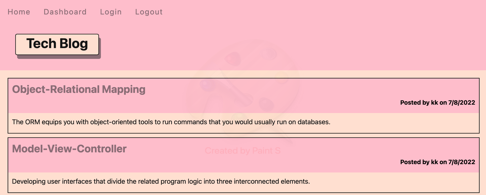

# Tech Blog

### This is the repository for the tech blog

### Table of Contents

- [Description](#description)
- [Screenshot](#screenshot)
- [Teachologies Used](#technologies-used)
- [Link](#link)
- [License](#license)
- [Contact Me](#contact-me)

### Description

A CMS-style blog site where developers can publish their blog posts and comment on other developers’ posts.

### Screenshot

User Interface

### Technologies Used

1. JavaScript
2. CSS
3. Node.js
   - dotenv
   - Express.js
   - Handlebars.js
   - Node MySQL 2
   - node.bcrypt.js
   - Sequelize.js

### Link:

Click [https://angelawong3-tech-blog.herokuapp.com/](https://angelawong3-tech-blog.herokuapp.com/) to go to the app.

### License

### Contact Me

Please contact me at angelawong3@yahoo.com

---

© 2022 Angela Wong
